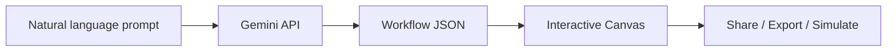

<div align="center">

# DevWorkflow Canvas

**Turn plain-language system descriptions into beautiful, editable architecture diagrams — powered by Gemini AI.**

[](LICENSE)
[](package.json)
[](https://react.dev/)
[](https://ai.google.dev/)
[](CONTRIBUTING.md)

[Features](#-features) · [Demo](#-demo) · [Quick Start](#-quick-start) · [Docs](#-workflow-json-schema) · [Contributing](CONTRIBUTING.md)

**[⭐ Star this repo](https://github.com/jsc2017605097/devworkflow-canvas)** if it helps your system design workflow!

</div>

---

## ✨ Why DevWorkflow Canvas?

Designing microservices, CI/CD pipelines, or data flows usually means fighting draw.io for hours — or maintaining stale diagrams in Confluence.

**DevWorkflow Canvas** lets you:

1. **Describe** your system in Vietnamese or English (natural language)
2. **Generate** a structured workflow JSON via **Google Gemini** (server-side, secure API key)
3. **Visualize** on an interactive canvas with node types, edge styles, and simulation
4. **Edit** live JSON, use built-in templates, and **share** via URL hash



## 🎬 Demo

> **Tip for maintainers:** Record a 10–15s GIF (`docs/demo.gif`) and replace the placeholder below — repos with demos get significantly more stars.

<!-- Replace with:  -->

| AI generation | Canvas & templates | Share via URL |
|:---:|:---:|:---:|
| Describe → JSON in seconds | Microservices, CI/CD, ETL templates | `#flow=` hash encoding |

**Example prompt:**
> *"E-commerce checkout: API Gateway → Auth → Cart → Billing (VNPay) → Email receipt"*

## 🚀 Features

| Feature | Description |
|---------|-------------|
| 🤖 **AI workflow generator** | Gemini turns prompts into valid workflow JSON (`/api/workflow/generate`) |
| 🎨 **Visual canvas** | Horizontal / vertical / custom layouts; 9 node types; styled edges |
| 📋 **Built-in templates** | Microservices, CI/CD GitOps, ETL pipelines — start instantly |
| 📝 **JSON editor** | Live edit with validation; syncs with canvas |
| ▶️ **Simulation mode** | Step-through highlight of nodes along the flow |
| 🔗 **Shareable links** | Encode workflow in URL hash — no backend storage needed |
| 🌐 **Bilingual prompts** | Optimized for **English & Vietnamese** system descriptions |
| 🔒 **Secure by design** | API key stays on server; never exposed to the browser |

## ⚡ Quick Start

### Prerequisites

- [Node.js](https://nodejs.org/) 18+
- [Gemini API key](https://aistudio.google.com/apikey)

### 1. Clone & install

```bash
git clone https://github.com/jsc2017605097/devworkflow-canvas.git
cd devworkflow-canvas
npm install
```

### 2. Configure environment

```bash
cp .env.example .env
```

Edit `.env`:

```env
GEMINI_API_KEY=your_gemini_api_key_here
```

### 3. Run (development)

```bash
npm run dev
```

Open **http://localhost:3000**

### Production build

```bash
npm run build
npm start
```

## 📐 Workflow JSON schema

```json
{
  "title": "My System",
  "description": "Optional summary",
  "layout": "horizontal",
  "nodes": [
    {
      "id": "api_gateway",
      "label": "API Gateway",
      "type": "gateway",
      "status": "success",
      "details": ["Kong", "Port 443"]
    }
  ],
  "edges": [
    {
      "from": "client",
      "to": "api_gateway",
      "label": "HTTPS",
      "type": "default"
    }
  ]
}
```

**Node types:** `user` · `gateway` · `service` · `database` · `queue` · `worker` · `external_api` · `condition` · `step`

**Edge types:** `default` · `success` · `error` · `dashed` · `bidirectional`

## 🛠 Tech stack

| Layer | Stack |
|-------|--------|
| Frontend | React 19, Vite 6, Tailwind CSS 4, Motion, Lucide |
| Backend | Express, `@google/genai` |
| Tooling | TypeScript, esbuild |

## 📁 Project structure

```
devworkflow-canvas/
├── server.ts              # Express + Vite middleware + Gemini API
├── src/
│   ├── App.tsx            # Main app shell
│   ├── components/        # Canvas, Editor, AiAssistant, Toolbar
│   └── types.ts           # Schema + templates
├── .env.example
└── package.json
```

## 🗺 Roadmap

- [ ] Export to PNG / SVG
- [ ] Drag-and-drop node repositioning
- [ ] GitHub OAuth + save workflows to Gist
- [ ] One-click deploy demo (Vercel / Railway)
- [ ] OpenAPI import → auto-generate nodes

Contributions welcome — see [CONTRIBUTING.md](CONTRIBUTING.md).

## 🤝 Contributing

We love PRs! Please read [CONTRIBUTING.md](CONTRIBUTING.md) before opening an issue or pull request.

## 📄 License

[MIT](LICENSE) © Contributors

---

## 🇻🇳 Tiếng Việt

**DevWorkflow Canvas** giúp bạn mô tả hệ thống bằng tiếng Việt/Anh → AI sinh JSON workflow → vẽ sơ đồ tương tác, chỉnh sửa, mô phỏng và chia sẻ link.

```bash
git clone https://github.com/jsc2017605097/devworkflow-canvas.git
cd devworkflow-canvas && npm install
cp .env.example .env   # thêm GEMINI_API_KEY
npm run dev
```

Nếu project hữu ích, hãy **[⭐ star repo](https://github.com/jsc2017605097/devworkflow-canvas)** để ủng hộ!
