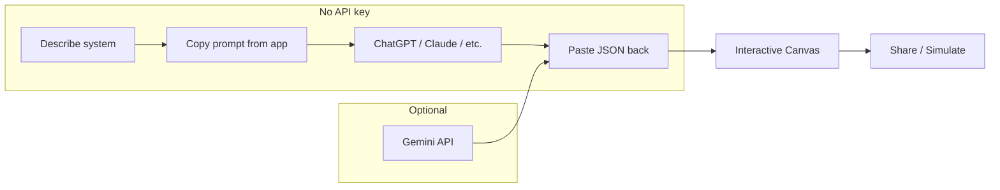

<div align="center">

# DevWorkflow Canvas

**Turn plain-language system descriptions into beautiful, editable architecture diagrams.**

[](LICENSE)
[](package.json)
[](https://react.dev/)
[](#-use-any-ai-no-api-key-required)
[](CONTRIBUTING.md)

[Features](#-features) · [No API key](#-use-any-ai-no-api-key-required) · [Quick Start](#-quick-start) · [Schema](#-workflow-json-schema) · [Contributing](CONTRIBUTING.md)

**[⭐ Star this repo](https://github.com/jsc2017605097/devworkflow-canvas)** if it helps your system design workflow!

</div>

---

## ✨ Why DevWorkflow Canvas?

Designing microservices, CI/CD pipelines, or data flows usually means fighting draw.io for hours — or maintaining stale diagrams in Confluence.

**DevWorkflow Canvas** lets you:

1. **Describe** your system in natural language (any language)
2. **Generate** workflow JSON with **any AI you already use** — or optional built-in Gemini
3. **Visualize** on an interactive canvas with node types, edge styles, and simulation
4. **Edit** live JSON, use built-in templates, and **share** via URL hash



## 🤖 Use any AI — no API key required

**You do not need a Gemini API key** to use this project.

The app includes an **“External AI”** tab (ChatGPT, Claude, Gemini web, Copilot, etc.):

1. Run the app locally (`npm run dev`) — **no `.env` file required**
2. Open the AI assistant panel → select **“External AI (ChatGPT / Claude…)”**
3. Enter your system topic → click **Copy prompt** — a structured instruction is copied to your clipboard
4. Paste it into **ChatGPT**, **Claude**, or any chat UI in your browser
5. Copy the **raw JSON** from the AI response
6. Paste it into the import box in the app → your diagram renders instantly

The copied prompt enforces the exact [workflow JSON schema](#-workflow-json-schema) so external models return paste-ready output.

> **Optional:** The **“Direct (Gemini)”** tab calls Gemini on the server. Set `GEMINI_API_KEY` in `.env` only if you want one-click generation without leaving the app.

## 🎬 Demo

> **Tip for maintainers:** Record a 10–15s GIF (`docs/demo.gif`) and uncomment the line below.

<!--  -->

| External AI (no key) | Canvas & templates | Share via URL |
|:---:|:---:|:---:|
| Copy prompt → ChatGPT/Claude → paste JSON | Microservices, CI/CD, ETL templates | `#flow=` hash encoding |

**Example system description (paste into the copied prompt or Direct tab):**

> *E-commerce checkout: API Gateway → Auth → Cart → balance check → Billing (VNPay) → email receipt*

## 🚀 Features

| Feature | Description |
|---------|-------------|
| 🌐 **Any AI, zero config** | Copy a schema-locked prompt → use ChatGPT, Claude, or others in the browser — no API keys |
| 🤖 **Optional Gemini** | Built-in server-side generation when `GEMINI_API_KEY` is set |
| 🎨 **Visual canvas** | Horizontal / vertical / custom layouts; 9 node types; styled edges |
| 📋 **Built-in templates** | Microservices, CI/CD GitOps, ETL pipelines — start instantly |
| 📝 **JSON editor** | Live edit with validation; syncs with canvas |
| ▶️ **Simulation mode** | Step-through highlight of nodes along the flow |
| 🔗 **Shareable links** | Encode workflow in URL hash — no backend storage needed |

## ⚡ Quick Start

### Prerequisites

- [Node.js](https://nodejs.org/) 18+ only

### 1. Clone & install

```bash
git clone https://github.com/jsc2017605097/devworkflow-canvas.git
cd devworkflow-canvas
npm install
```

### 2. Run (no API key)

```bash
npm run dev
```

Open **http://localhost:3000** → use **External AI** tab with ChatGPT or Claude.

### 3. Optional — built-in Gemini

```bash
cp .env.example .env
```

Add your key from [Google AI Studio](https://aistudio.google.com/apikey):

```env
GEMINI_API_KEY=your_gemini_api_key_here
```

Restart the server, then use the **Direct (Gemini)** tab.

### Production build

```bash
npm run build
npm start
```

## 📐 Workflow JSON schema

External AI and Gemini must return JSON matching this shape:

```json
{
  "title": "My System",
  "description": "Optional summary",
  "layout": "horizontal",
  "nodes": [
    {
      "id": "api_gateway",
      "label": "API Gateway",
      "type": "gateway",
      "status": "success",
      "details": ["Kong", "Port 443"]
    }
  ],
  "edges": [
    {
      "from": "client",
      "to": "api_gateway",
      "label": "HTTPS",
      "type": "default"
    }
  ]
}
```

**Node types:** `user` · `gateway` · `service` · `database` · `queue` · `worker` · `external_api` · `condition` · `step`

**Edge types:** `default` · `success` · `error` · `dashed` · `bidirectional`

**Layouts:** `horizontal` · `vertical` · `custom`

## 🛠 Tech stack

| Layer | Stack |
|-------|--------|
| Frontend | React 19, Vite 6, Tailwind CSS 4, Motion, Lucide |
| Backend | Express (optional Gemini via `@google/genai`) |
| Tooling | TypeScript, esbuild |

## 📁 Project structure

```
devworkflow-canvas/
├── server.ts              # Express + Vite; optional /api/workflow/generate
├── src/
│   ├── App.tsx
│   ├── components/        # Canvas, Editor, AiAssistant (Direct + External AI)
│   └── types.ts           # Schema + templates
├── .env.example           # Optional — only for Gemini Direct tab
└── package.json
```

## 🗺 Roadmap

- [ ] Export to PNG / SVG
- [ ] Drag-and-drop node repositioning
- [ ] One-click deploy demo (Vercel / Railway)
- [ ] OpenAPI import → auto-generate nodes

Contributions welcome — see [CONTRIBUTING.md](CONTRIBUTING.md).

## 🤝 Contributing

We love PRs! Please read [CONTRIBUTING.md](CONTRIBUTING.md) before opening an issue or pull request.

## 📄 License

[MIT](LICENSE) © Contributors
